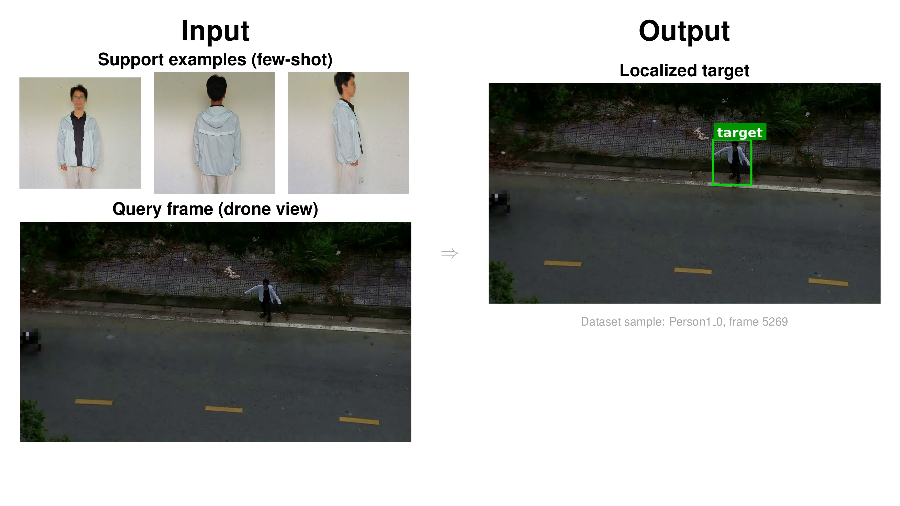
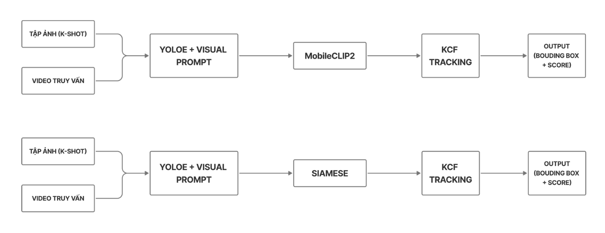

# Drone Few-shot Detection & Tracking

Pipeline few-shot để định vị và theo dõi một đối tượng trong video drone từ một tập ảnh support nhỏ.

<p align="center">
  <code>YOLOE Visual Prompt</code> · <code>MobileCLIP2/Siamese Matching</code> · <code>KCF Tracking</code> · <code>JSON/Report/Plot</code>
</p>

## Tổng Quan

| Thành phần | Mô tả |
| --- | --- |
| Input | `object_images/*.jpg|*.png` (support) + `drone_video.mp4` |
| Output chính | `result/submission*.json` (bbox theo từng video) |
| Output phụ | `*_report.txt`, `*_stats.png`, debug frames (nếu bật) |
| Ý tưởng | 1 pipeline detector/tracker dùng chung, 2 matcher backend có thể hoán đổi |

<p align="center">
  
</p>

## Pipeline Thực Thi

> Lưu ý: repo hiện có **một pipeline inference thống nhất** (`inference.py`) với **hai backend matcher**: `mobileclip2` và `siamese`.

<p align="center">
  
</p>

```text
preprocessing.py
  -> preprocessed_data/<split>/<SampleID>/initial_vpe.pt
  -> preprocessed_data/<split>/<SampleID>/reference_crops.npy
  -> preprocessed_data/<split>/dataset_metadata.json

inference.py (shared runtime)
  1) YOLOE sinh proposals trên từng frame
  2) Matcher branch (chọn 1):
       - mobileclip2: embedding similarity qua MobileCLIP2
       - siamese: embedding similarity qua Siamese checkpoint
  3) fusion.py gộp score detector + matcher (+ tracker bonus)
  4) tracker.py / tracker_adapter.py ổn định bbox giữa các lần re-init
  5) xuất submission JSON + report + plot
```

Flow score cho mỗi proposal:

1. `detector_score` từ YOLOE confidence.
2. `matcher_score` từ backend đã chọn (`mobileclip2` hoặc `siamese`).
3. Cộng `tracker_bonus` nếu proposal overlap với bbox tracker trước đó.
4. `fusion.py` chuẩn hóa + weighted fusion theo `w_det` và `w_match`.
5. Nhận bbox nếu vượt `fused_threshold` và gate bởi `match_threshold`.

## Chế Độ Chạy Matcher

`predict.sh` hỗ trợ 3 mode qua biến `MATCHER`:

| `MATCHER` | Hành vi | File output |
| --- | --- | --- |
| `mobileclip2` | Chạy pipeline với matcher MobileCLIP2 | `result/submission.json` |
| `siamese` | Chạy pipeline với matcher Siamese | `result/submission.json` |
| `all` hoặc `compare` | Chạy tuần tự cả 2 matcher trên cùng preprocessed data | `result/submission_mobileclip2.json` + `result/submission_siamese.json` |

Với mỗi file JSON ở trên, pipeline cũng sinh thêm:

- `<stem>_report.txt`
- `<stem>_stats.png`

Ví dụ mode `all` sẽ có:

```text
result/submission_mobileclip2.json
result/submission_mobileclip2_report.txt
result/submission_mobileclip2_stats.png
result/submission_siamese.json
result/submission_siamese_report.txt
result/submission_siamese_stats.png
```

## Cấu Trúc Repo

```text
.
├── assets/                         # Hình minh họa cho README
├── data/                           # Dataset local (ignore khỏi git)
├── models/                         # Model weights local (ignore khỏi git)
├── preprocessed_data/              # Artifact từ preprocessing
├── result/                         # Submission, report, plot, debug
├── tasks/demo_configs/             # Config/demo JSON cho thuyết trình
├── preprocessing.py                # Tạo VPE + reference crops
├── inference.py                    # Pipeline inference thống nhất
├── matcher.py                      # MobileCLIP2 matcher + Siamese matcher
├── fusion.py                       # Weighted fusion detector/matcher/tracker
├── tracker.py                      # KCF tracker logic
├── tracker_adapter.py              # Chọn backend KCF/legacy_kcf
├── predict.sh                      # Runner end-to-end
├── predict.py                      # Wrapper tương thích cũ -> inference.py
├── siamese/                        # Train/evaluate Siamese verifier
└── yoloe/                          # Helper scripts YOLO/YOLOE
```

## Cài Đặt Môi Trường

```bash
python -m pip install --upgrade pip
python -m pip install -r requirements.txt
python check_env.py
```

Hoặc:

```bash
./setup_env.sh
```

Dependency chính:

| Package | Vai trò |
| --- | --- |
| `torch`, `torchvision` | Inference/embedding model |
| `ultralytics` | YOLO/YOLOE |
| `opencv-contrib-python` | KCF tracker |
| `scikit-learn` | Color clustering trong preprocessing |
| `matplotlib` | Vẽ thống kê detection rate |

## Chuẩn Bị Dữ Liệu & Weights

### Layout public test

```text
data/public_test/samples/<SampleID>/
├── drone_video.mp4
└── object_images/
    ├── *.jpg
    └── *.png
```

### Layout train

```text
data/train/
├── annotations/annotations.json
└── samples/<SampleID>/
    ├── drone_video.mp4
    └── object_images/
```

### Weights tối thiểu

```text
models/
├── yolov8n.pt
├── yoloe-11l-seg.pt
├── yoloe-11s-seg.pt                  # fallback nếu thiếu 11l
└── mobileclip2_image_encoder_fp16.pt
```

Nếu chạy `--matcher siamese`, cần thêm checkpoint:

```text
result/siamese/best.pt
```

## Chạy Nhanh

Chạy mặc định (MobileCLIP2):

```bash
./predict.sh
```

Chạy Siamese:

```bash
MATCHER=siamese ./predict.sh
```

Chạy so sánh cả hai matcher trên cùng dữ liệu:

```bash
MATCHER=all ./predict.sh
```

Smoke test nhẹ:

```bash
LIMIT_SAMPLES=1 MAX_FRAMES=120 MATCHER=all ./predict.sh
```

## Các Biến Cấu Hình Qua `predict.sh`

| Biến | Mặc định | Ý nghĩa |
| --- | --- | --- |
| `MATCHER` | `mobileclip2` | `mobileclip2`, `siamese`, `all`, `compare` |
| `SIAMESE_CHECKPOINT` | `result/siamese/best.pt` | Checkpoint Siamese |
| `YOLOE_CONF` | `0.001` | Ngưỡng proposal của detector |
| `TOP_K` | `24` | Số proposal giữ lại mỗi frame |
| `FUSED_THRESHOLD` | `0.52` | Ngưỡng nhận bbox sau fusion |
| `W_DET` | `0.30` | Trọng số detector score |
| `W_MATCH` | `0.35` | Trọng số matcher score |
| `MATCH_THRESHOLD` | `0.10` | Ngưỡng gate matcher |
| `SIMILARITY_ADD_THRESHOLD` | `0.80` | Ngưỡng thêm support mới |
| `NUM_BACKGROUNDS` | `4` | Số background cho augmentation |
| `MIN_AUG_SCALE` | `0.04` | Tỉ lệ scale object nhỏ nhất khi augment |
| `MAX_AUG_SCALE` | `0.20` | Tỉ lệ scale object lớn nhất khi augment |
| `VPE_IMGSZ` | `640` | Kích thước ảnh cho VPE extractor |
| `LIMIT_SAMPLES` | `0` | Giới hạn số video (0 = tất cả) |
| `MAX_FRAMES` | `0` | Giới hạn số frame/video (0 = tất cả) |

## Chạy Thủ Công

### 1) Preprocessing

```bash
python preprocessing.py \
  --dataset data/public_test \
  --output-dir preprocessed_data/public_test \
  --yoloe-weights models/yoloe-11l-seg.pt \
  --yolov8-weights models/yolov8n.pt \
  --num-backgrounds 4 \
  --min-aug-scale 0.04 \
  --max-aug-scale 0.20 \
  --vpe-imgsz 640
```

### 2) Inference với MobileCLIP2

```bash
python inference.py \
  --preprocessed-dir preprocessed_data/public_test \
  --output-json result/submission_mobileclip2.json \
  --matcher mobileclip2 \
  --clip-encoder-path models/mobileclip2_image_encoder_fp16.pt
```

### 3) Inference với Siamese

```bash
python inference.py \
  --preprocessed-dir preprocessed_data/public_test \
  --output-json result/submission_siamese.json \
  --matcher siamese \
  --siamese-checkpoint result/siamese/best.pt
```

### 4) Bật debug frames

```bash
python inference.py \
  --preprocessed-dir preprocessed_data/public_test \
  --output-json result/debug_subset.json \
  --limit-videos 1 \
  --max-frames 1200 \
  --save-frames \
  --frames-output-dir result/debug_frames
```

## Siamese Training/Evaluation (Tùy chọn)

Train lại Siamese verifier:

```bash
python siamese/train.py \
  --config siamese/train_config.yaml \
  --force-rebuild-cache
```

Evaluate checkpoint:

```bash
python siamese/evaluate.py \
  --checkpoint result/siamese/best.pt \
  --config siamese/train_config.yaml \
  --output result/siamese/evaluation.json
```

## Ghi Chú Vận Hành

- Nếu thiếu `models/yoloe-11l-seg.pt`, `inference.py` sẽ fallback sang `models/yoloe-11s-seg.pt` nếu có.
- Tracker ưu tiên backend `kcf`, sau đó fallback `legacy_kcf`.
- `ml-mobileclip/` là dependency local để load `open_clip` khi chạy matcher `mobileclip2`.
- `data/`, `models/`, `preprocessed_data/`, `result/` là local artifacts, thường được ignore khỏi git.
